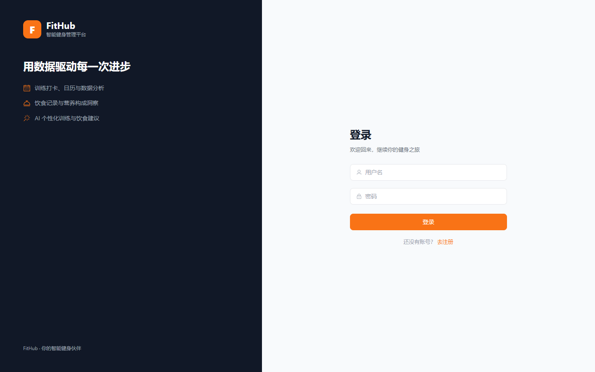
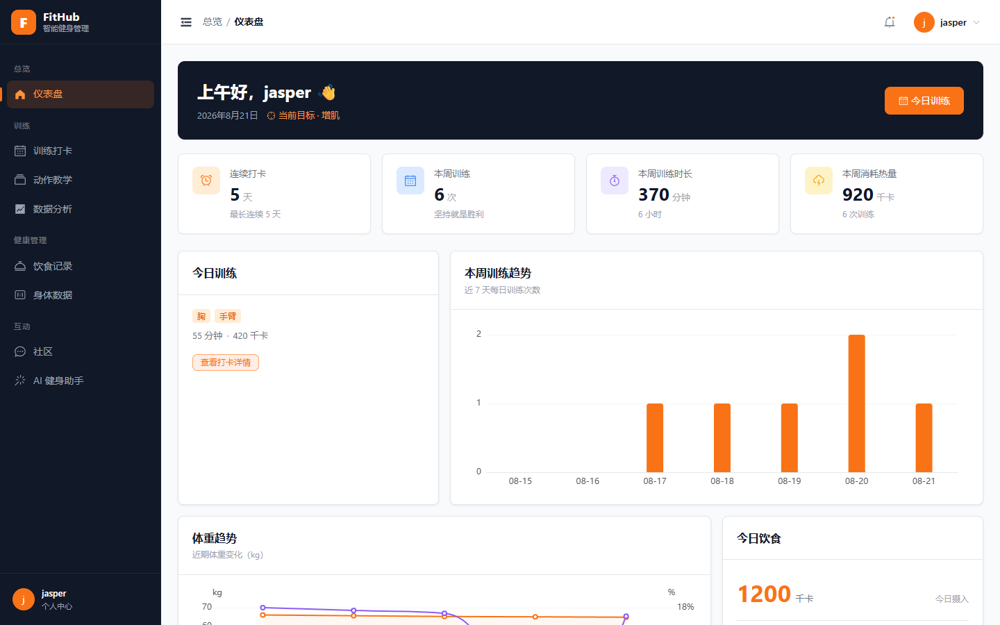
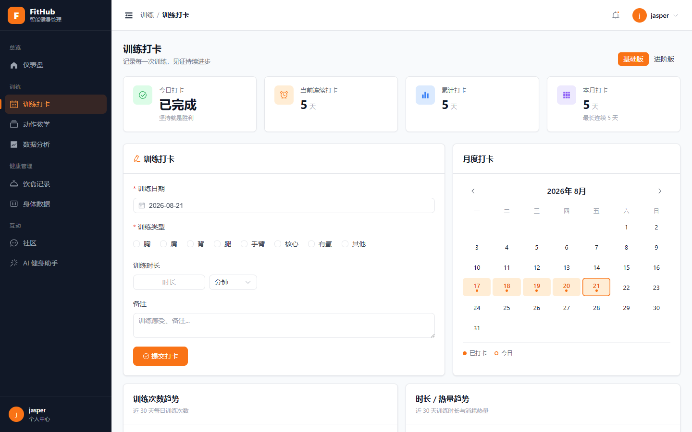
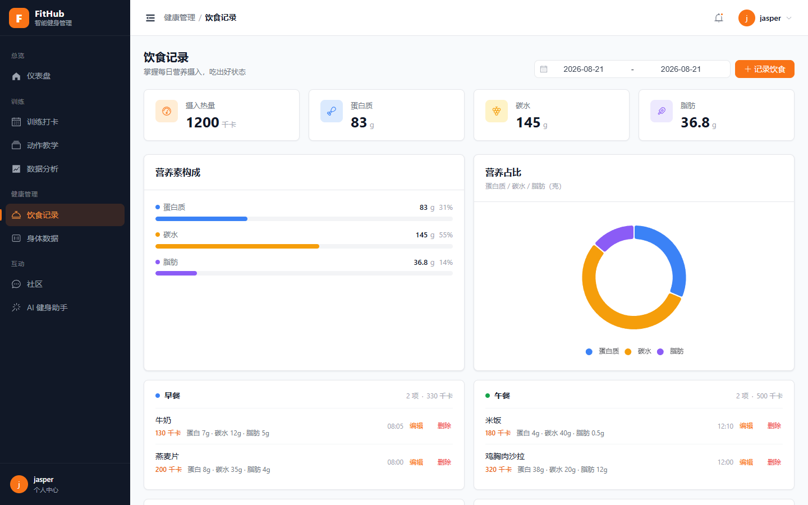
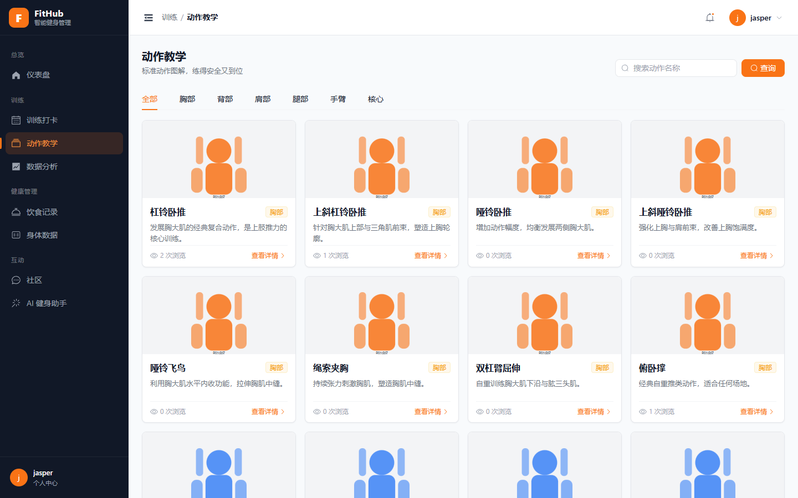
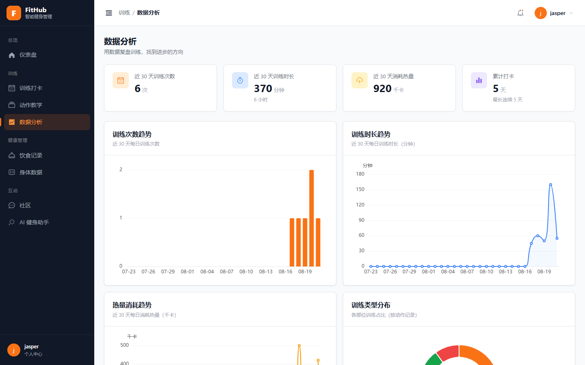
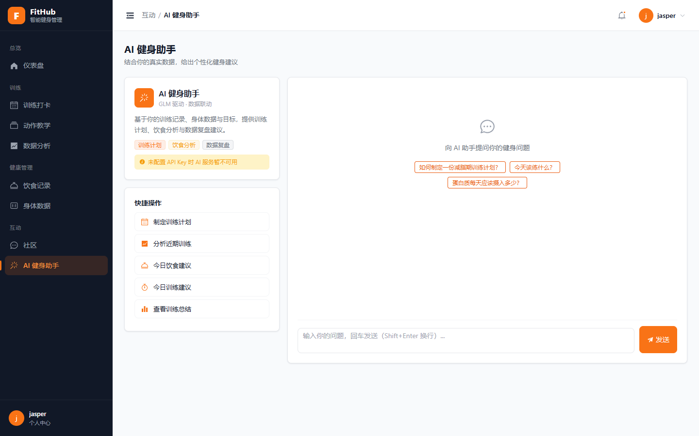
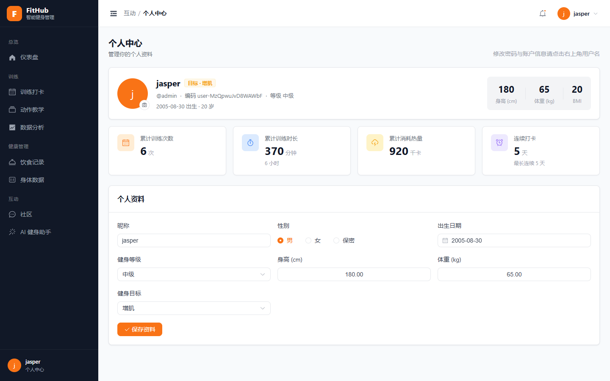

# FitHub · 智能健身管理平台

## 项目简介

FitHub 是一个**前后端分离**的多用户在线健身管理平台。后端基于 Spring Boot 3 提供 REST API，前端使用 Vue 3 + TypeScript 构建。项目覆盖健身管理的完整闭环：训练打卡、饮食记录、身体数据追踪、动作教学、数据分析与 AI 个性化建议。

**设计风格**：现代专业的健身产品视觉 —— 运动橙主色、深色侧边栏、统一 Design Token、ECharts 数据可视化、完整的响应式与交互状态（加载/空态/错误/删除确认）。

---

**English**: A full-stack smart fitness management platform built with **Spring Boot 3 + Vue 3**. Track workouts & diet, record body metrics, browse an illustrated exercise library, analyze trends with ECharts, and get AI coaching powered by **Zhipu GLM** — all in one clean, modern UI.

     

## 🖥️ 界面预览

| | |
|:---:|:---:|
|  |  |
|  |  |
|  |  |
|  |  |

## ✨ 功能特性

- 🏋️ **训练打卡** — 基础 / 进阶双模式、月度打卡日历、连续打卡统计、近 30 天趋势分析
- 🥗 **饮食记录** — 早 / 午 / 晚 / 加餐分组、热量与营养素（蛋白质/碳水/脂肪）可视化
- 📏 **身体数据** — 体重 / 体脂率 / BMI 记录与趋势图
- 📚 **动作教学** — 42 个标准动作，分类 + 搜索，SVG 剪影图解与动作要领
- 📊 **数据分析** — ECharts 多维度趋势：训练次数、时长、热量、训练类型占比
- 💬 **社区** — 发帖、点赞、收藏、转发、评论
- 🤖 **AI 健身助手** — 智谱 GLM 驱动，结合真实数据生成训练计划 / 饮食分析 / 数据复盘

## 🛠️ 技术栈

| 层 | 技术 |
|---|---|
| 后端 | Java 21 · Spring Boot 3.3 · Spring MVC · MyBatis-Plus · Spring Security 6 + JWT · MySQL 8 · Redis |
| 前端 | Vue 3 · TypeScript · Vite · Element Plus · Pinia · Axios · ECharts |
| AI | 智谱 GLM（OpenAI 兼容协议，模型 `glm-4.7-flash`） |
| 构建 / 部署 | Maven · npm · Docker Compose · Nginx |

## 📁 项目结构

```
fitness-web/
├── server/                 # Spring Boot 后端（com.fitness）
│   ├── scripts/            # 动作 SVG 生成脚本
│   └── src/main/java/com/fitness/{common,config,security,controller,service,mapper,entity,dto,vo,ai}
├── client/                 # Vue 3 + Vite 前端
│   ├── public/exercises/   # 42 个动作 SVG 静态资源
│   ├── scripts/            # QA 工具（截图诊断 / 评论回归）
│   └── src/{api,components,composables,constants,layouts,router,stores,styles,types,utils,views}
├── docs/                   # 架构与数据库设计文档
├── screenshots/            # 界面截图
└── docker-compose.yml      # MySQL + Redis
```

## 🚀 快速开始

**前置**：JDK 21、Maven、Node.js 18+、Docker（可选，用于本地依赖）

```bash
# 1. 启动依赖（MySQL + Redis）
docker compose up -d

# 2. 启动后端（:8080）
cd server && mvn spring-boot:run

# 3. 启动前端开发（:5173）
cd client && npm install && npm run dev
```

**默认账号**：`admin` / `admin123`（开发演示账号；**生产部署请通过环境变量 `FITNESS_ADMIN_PASSWORD` 修改默认密码**）

> 💡 AI 功能已内置**免费 GLM API Key**，开箱即用；如需更换 key，设置环境变量 `GLM_API_KEY` 即可覆盖。

## 📚 文档

- [docs/architecture.md](docs/architecture.md) — 系统架构设计
- [docs/database.md](docs/database.md) — 数据库表设计
- [CLAUDE.md](CLAUDE.md) — 开发规范与约定（供协作 / AI 编码参考）

## 📄 License

MIT License
